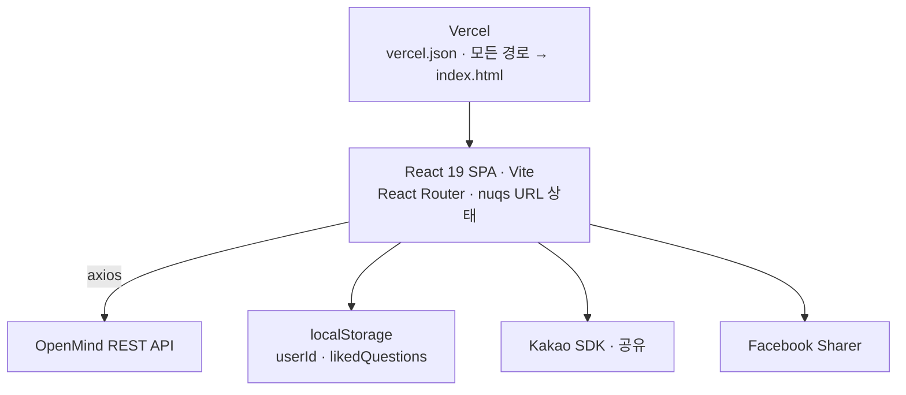

# 🔑 OpenSesame, 열려라참깨

> **Forked from:** [Open-Sesame](https://github.com/Choiyuhyeon/Open-Sesame)
>
> 팀 프로젝트 '열려라참깨' 종료 후, 기술적 성장을 이어가고자 포크해 Vercel에 배포했습니다.

<br>

열려라참깨는 사용자가 질문 피드를 만들고, 다른 사용자들과 질문·답변을 주고받으며 소통하는 커뮤니티 서비스입니다.<br>
익명 혹은 기명으로 마음을 열고 대화하는 공간을 지향합니다.
<br><br>

## 📍 목차

- [개요](#overview)
- [Fork 이후 개선 작업](#improvements)
- [주요 기능](#features)
- [기술 스택](#stack)
- [시스템 아키텍처](#architecture)
- [프로젝트 구조](#structure)
- [라우팅 구조](#routing)
- [시작하기](#getting-started)

---

<div id="overview"></div>

## 📋 개요

| 구분                    | 개발기간           | 내용                                           |
| ----------------------- | ------------------ | ---------------------------------------------- |
| **원본 팀 프로젝트**    | 2026.03.04 ~ 03.19 | 6인 팀 · 담당: 개별 피드 페이지 · 공유 기능    |
| **Fork 이후 개인 작업** | 2026.03.19 ~       | 아래 [Fork 이후 개선 작업](#improvements) 참조 |

- [**Vercel 배포**](https://opensesame-imyoonsoo.vercel.app)

<br>

<div id="improvements"></div>

## 📈 Fork 이후 개선 작업

팀 프로젝트를 포크한 뒤 개인으로 진행한 작업입니다.

### SPA 라우팅 404 해결

Vercel에 배포한 뒤 `/list`나 `/post/:id`에서 새로고침하면 404가 발생했습니다. 정적 호스팅은 요청받은 경로에 해당하는 파일을 실제로 찾으려 하지만, SPA에서 그 경로는 클라이언트 라우터에만 존재하기 때문입니다.

`vercel.json`에 모든 경로를 `index.html`로 넘기는 rewrite를 추가해, 어떤 경로로 직접 진입하더라도 앱이 먼저 로드된 뒤 라우터가 화면을 결정하도록 했습니다.

<br>

<div id="features"></div>

## ✨ 주요 기능

- **피드 생성** — 이름을 입력해 나만의 질문 피드 생성
- **질문하기** — 다른 사용자에게 익명으로 질문 작성
- **답변 관리** — 받은 질문에 답변 작성 / 수정 / 삭제
- **반응하기** — 답변에 좋아요 반응
- **공유하기** — 카카오톡 · 페이스북 · 링크 복사로 피드 공유
- **반응형 디자인** — 모바일 · 태블릿 · 데스크톱 최적화

<br>

<div id="stack"></div>

## 🔧 기술 스택

| Category         | Tech               |
| ---------------- | ------------------ |
| **Library**      | React 19           |
| **Build Tool**   | Vite 7             |
| **Routing**      | React Router DOM 7 |
| **URL State**    | nuqs               |
| **HTTP Client**  | Axios              |
| **Styling**      | CSS                |
| **Code Quality** | ESLint, Prettier   |

<br>

<div id="architecture"></div>

## 🏗️ 시스템 아키텍처

백엔드 REST API는 외부에서 제공되며, 이 저장소는 프론트엔드만 담당합니다.
브라우저가 API를 직접 호출하는 **단순 SPA 구조**입니다.



목록의 정렬·페이지 상태는 `nuqs`로 URL 쿼리에 동기화됩니다. 새로고침하거나 뒤로가기를 눌러도, 링크를 그대로 공유해도 보던 목록이 유지됩니다.
로그인 없이 동작하는 서비스라 사용자 식별과 좋아요 중복 방지는 `localStorage`에 의존합니다.

<br>

<div id="structure"></div>

## 🗂️ 프로젝트 구조

```
src/
├── api/            # API 통신 (question · answer · subject)
├── assets/         # 아이콘 · 이미지 등 정적 자원
├── components/     # 도메인별 UI 컴포넌트 (common · home · list · post · answer)
├── hooks/          # 커스텀 훅
├── layouts/        # 공통 레이아웃 (Layout)
├── pages/          # 페이지 (HomePage · ListPage · PostPage · AnswerPage)
├── styles/         # 디자인 토큰 (color.css · typography.css)
├── utils/          # axios 인스턴스
├── App.jsx         # 라우팅 정의
├── main.jsx        # 앱 진입점
└── global.css      # 전역 스타일
```

<br>

<div id="routing"></div>

## 🛣️ 라우팅 구조

| 경로               | 페이지         | 설명                                      |
| ------------------ | -------------- | ----------------------------------------- |
| `/`                | **HomePage**   | 이름 입력 및 피드 생성                    |
| `/list`            | **ListPage**   | 질문 피드 목록 조회 (정렬 · 페이지네이션) |
| `/post/:id`        | **PostPage**   | 특정 피드 질문 조회, 좋아요 · 공유        |
| `/post/:id/answer` | **AnswerPage** | 답변 작성 / 수정 / 삭제 (피드 소유자용)   |

`/list` · `/post/:id` · `/post/:id/answer`는 공통 `Layout` 안에서 렌더링됩니다.

<br>

<div id="getting-started"></div>

## 🚀 시작하기

```bash
npm install
npm run dev      # 개발 서버
npm run build    # 프로덕션 빌드
npm run preview  # 빌드 결과 미리보기
```

API 주소는 `src/utils/axios.js`에 지정되어 있어 별도의 환경변수 설정이 필요하지 않습니다.
